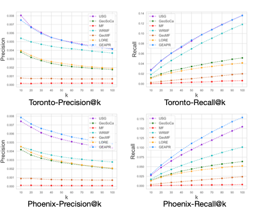

# GEAPR: 

Author: Zeyu Li <zyli@cs.ucla.edu> or <zeyuli@g.ucla.edu>


## TODO
3. Polish the README to make it reproducible.
4. Polish the grid search file
5. Reorganize the github repo
6. Add figures to the REPO
7. Delete unused branches in the source code
8. Add end-to-end instruction from downloading dataset to fetch results
9. Remove extract printing except for the results
10. Improve the starting of the program and let it print parameter settings
11. Remove unused arguments in the `main_zyli.py` and also change the name of this `main_zyli.py`
12. Fix all assert with a string of error message

## What is GEAPR?
GEAPR stands for "**G**raph **E**nhanced **A**ttention network for explainable **P**OI **R**ecommendation".
The major architecture of GEAPR is the following:


In short, it uses the four different modules to analyze four motivating factors of a POI visit, 
namely structural context, neighbor impact, user attribute, and geolocation.

GEAPR can achieve a great performance shown below.




## Download raw dataset
Please download the data set from [here](https://www.yelp.com/dataset).
After download, untar it into `./data/raw/yelp` by the steps below, and ready to the next step!
```shell script
$ cd path/to/GEAPR
$ mkdir -p data/raw/yelp/
$ tar -vxf path/to/yelp_dataset.tar -C data/raw/yelp
```

## Preprocessing

#### 0. All in one script
Run this script to avoid all the following steps.
```shell script
$ bash preprocess_datasets.sh
```

#### 1. Parse the raw datasets
```bash
$ python preprocess/prep_yelp.py preprocess
```

#### 2. Cluster the data records by cities
```bash
$ python preprocess/prep_yelp.py city_cluster --business_min_count [bmc] --user_min_count [umc]
```

For example, if both minimum business count and minimum user count are 10, then we have:
```bash
$ python preprocess/prep_yelp.py city_cluster --business_min_count 10 --user_min_count 10
```
Running this step will generate the statistics of datasets. We summarize them as the following.
`lv` stands for Las Vegas, `tor` stands for Toronto, and `phx` stands for Pheonix.

#### 3. Generate train, test, and validation dataset
```bash
$ python preprocess/prep_yelp.py gen_data --train_test_ratio=[train:test]
```
For example, if we choose to use train:test as 9:1, then we should use:
```bash
$ python preprocess/prep_yelp.py gen_data --train_test_ratio=9:1
```
The statistics
```text
City    #.user  #.POI  #.attr   
phx     11289   9633   140
tor     9582    9102   140
```

#### 4. Find the results
In `./data/parse/yelp`, you would be able to see three folders:
* `train_test`: the training set, testing set, and the negative sampling set.
* `citycluster`: all information clustered by cities (`lv`, `tor`, or `phx`)
* `preprocess`: undivided features of preprocessing.
* `interactions`: user-POI interactons 

Among them, `citycluster` and `interactions` will be used in the future procedures.

## Feature Engineering 
Want to run? Not done yet, we need to run some code to extract the features for user and POI such as attributes and POI locations.
Based on the preprocessed features, we further create adjacency matrix features 
and user/POI attribute features. Both of them will be fed into our model.

#### 1. Building Structural Graphes

We are using structural context graphs for later computations. 
Structural context graphs can be generated beforehand.
Here's an example to generate neighbor graphs and structural context graphs:
```bash
$ python preprocess/build_graphs.py --yelp_city=tor --rwr_order=3 --rwr_constant 0.05 --use_sparse_mat=True
```
Here are two tunable hyperparameters:
* `rwr_order`: choose between 2 and 3, number > 3 will generate a much denser graph. Defult is 3.
* `rwr_constant`: rate of re-starting. Default is 0.05.
* `use_sparse`: whether or not to use `scipy.sparse` matrix to save data. Well, the option of `False` has not been tested. Please stick to `True`.


#### 2. Extracting user and item features

We also need to extract features from the user side. Just run the following commands:
```bash
$ python preprocess/attributes_extractor.py [city]
```
`city` can be `lv`, `tor`, `phx`, and `all`. `all` will auto run all cities.
This will generate `processed_city_user_profile.csv`, `processed_city_business_profile.csv`, `processed_city_user_profile_distinct.csv`, and `cols_disc_info.pkl`.
in `data/parse/yelp/citycluster/[city]`. 
It will also print out the percentage of empty values under each feature column.
In the later training steps, the model will NOT use `processed_city_user_profile.csv` and `processed_city_business_profile.csv` because: (1) we don't use business information in the model; (2) `processed_city_user_profile.csv` isn't parsed to discrete categorical features by bucketing yet.

Please pay attention to the `[num_bkt]`, we are using bucketing for all features by default. If some of the features are categorical and you don't think applying bucketing on that is a good idea. Please add the column name in `configs/user_attr_discrete.txt`: one-line per column name.

#### 3. Extract Geolocation features and user/POI adj features
Use the following command to extract the geolocation features and user/POI adjacency features.
```bash
$ python src/geolocations.py --city=[city] --num_lat_grid [n] --num_long_grid [n] --num_user 9582 --num_business 9102
```
For example, in order to handle `tor` dataset, we will input
```bash
$ python src/geolocations.py --city=tor --num_lat_grid 30 --num_long_grid 30 --num_user 9582 --num_business 9102
```


## Run it!

### 1. Parameters
 - What are they?
 - What to tune?

### 2. Running 

### 3. Performance

### 4. Find the interpretations


## Appendix

1. To disable the wordy `Warnings` of TensorFlow please add the following:
```python
import os
os.environ['TF_CPP_MIN_LOG_LEVEL'] = '3'  # << this line disables the warnings
import tensorflow as tf
```
However, the deprecation warnings are not removable.
